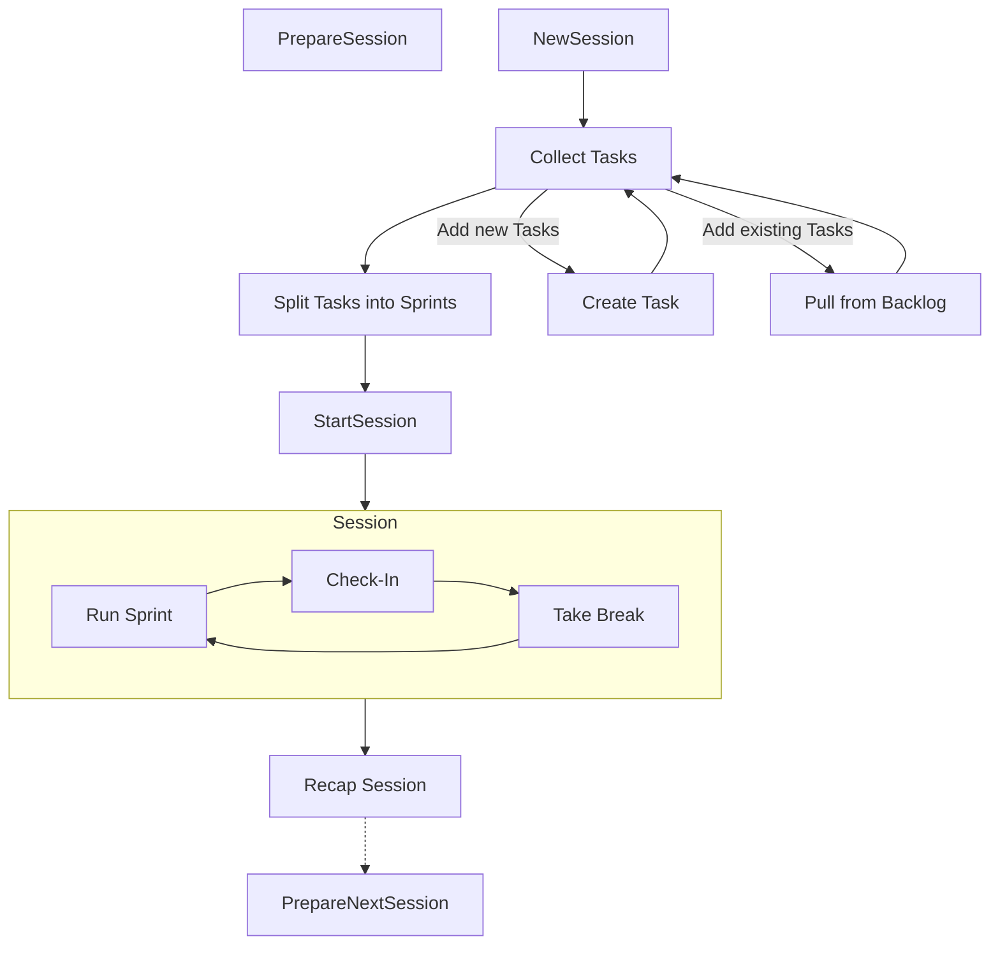

# Summary

This AI-powered productivity app helps you work with focus, structure, and accountability. It guides you through planning your day, executing focused work intervals, and reflecting on your performance.

## Terminology

**Task**: A discrete unit of work that can be assigned to a project and tagged with multiple labels. Tasks include estimates for completion time and complexity level. Complex tasks can be broken down into subtasks for easier management.

**Subtask**: A smaller component of a parent task that helps manage complex work more effectively. Like tasks, subtasks can also have their own tags, time estimates, and complexity ratings.

**Sprint**: A focused work period based on the Pomodoro technique, during which you work on a specific set of tasks.

**Session**: Your complete work period for the day, made up of multiple sprints, breaks, and transitions between activities.

**Check-In**: A brief evaluation after each sprint where you report your progress, focus level, and energy to help adjust upcoming sprints.

**Break**: A short rest period between sprints designed to refresh your mental energy and prevent burnout.

**Backlog**: Your collection of all tasks waiting to be addressed in future sessions.

**Recap**: An end-of-day summary showing your session data, completed tasks, and insights about your productivity.

## Core Features

### [Task Management](features/task-management.md)

> Effectively manage tasks, including setting estimates, organizing with tags, and syncing with external tools for streamlined progress tracking and prioritization.

### [Work Orchestration](features/work-orchestration.md)

> Optimize your work sessions by structuring tasks into balanced sprints, planning strategic breaks, and adjusting based on progress to maintain productivity.

### [Deep Work](features/deep-work.md)

> Foster an environment that minimizes distractions and enhances focus, enabling sustained attention and productivity through structured work intervals.

### [Social Reinforcement](features/social-reinforcement.md)

> Strengthen productivity habits through social connections and accountability, using shared experiences and structured support systems.

### [Performance Intelligence](features/performance-intelligence.md)

> Gain insights into productivity patterns and optimize future sessions by reviewing detailed recaps and tracking focus levels and completion rates.

## User Flow

